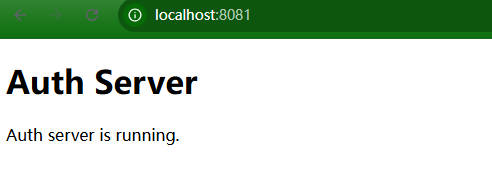

# OAuth Sample

Sample Project that use OAuth 2.1 to secure SpringBoot API backend and Next.js frontend.

## Step 1: Create resource server

Create an ordinary springboot project serving restful api. It'll serve the role of resource server and client of OAuth.

### Add dependecies

```xml
<dependency>
    <groupId>org.springframework.boot</groupId>
    <artifactId>spring-boot-starter-actuator</artifactId>
</dependency>
<dependency>
    <groupId>org.springframework.boot</groupId>
    <artifactId>spring-boot-starter-web</artifactId>
</dependency>
<!-- spring doc -->
<dependency>
    <groupId>org.springdoc</groupId>
    <artifactId>springdoc-openapi-starter-webmvc-ui</artifactId>
    <version>2.7.0-RC1</version>
</dependency>
<dependency>
    <groupId>org.springframework.boot</groupId>
    <artifactId>spring-boot-starter-test</artifactId>
    <scope>test</scope>
</dependency>
```

### Set Application properties

Set port and application name in `application.properties`:

```text
spring.application.name=resource-server
server.port=8082
```

### Create Some model classes

1. General Exception for the api

    ```java
    public class ApiException extends RuntimeException {
        private String name;

        public ApiException(String name, String message) {
            super(message);
            this.name = name;
        }

        public ApiException(String name, String message, Throwable cause) {
            super(message, cause);
            this.name = name;
        }

        public String getName() {
            return name;
        }

        public void setName(String name) {
            this.name = name;
        }

        @Override
        public String toString() {
            return "ApiException [name = " + name + ", " + super.toString() + "]";
        }
    }
    ```

2. ResultEntity & ErrorInfo

    ```java
    public class ErrorInfo 
    {
        private String errorName;
        private String errorMessage;
        private String errorDetails;

        public ErrorInfo(String errorName, String errorMessage) 
        {
            this(errorName, errorMessage, null);
        }
        
        public ErrorInfo(String errorName, String errorMessage, String errorDetails) 
        {
            this.errorName = errorName;
            this.errorMessage = errorMessage;
            this.errorDetails = errorDetails;
        }

        public ErrorInfo(Throwable throwable)
        {
            this.errorName = throwable.getClass().getName();
            this.errorMessage = throwable.getMessage();
            try(StringWriter sw = new StringWriter();
                PrintWriter pw = new PrintWriter(sw))
            {
                throwable.printStackTrace(pw);
                this.errorDetails = sw.toString();
            }
            catch(Exception ex)
            {
                ex.printStackTrace();
            }
        }

        // getters and setters and toString() ...
    }
    ```

    ```java
    public class ResultEntity<T> 
    {
        private boolean success;
        private ErrorInfo errorInfo;
        private T result;

        public static <T> ResultEntity<T> success(T data)
        {
            return new ResultEntity<T>(true, null, data);
        }

        public static <T> ResultEntity<T> fail(String errorName, String errorMessage, String errorDetails) 
        {
            ErrorInfo errorInfo = new ErrorInfo(errorName, errorMessage, errorDetails);
            return new ResultEntity<T>(false, errorInfo, null);
        }

        public static <T> ResultEntity<T> fail(Throwable throwable) 
        {
            ErrorInfo errorInfo = new ErrorInfo(throwable);
            return new ResultEntity<T>(false, errorInfo, null);
        }

        public static <T> ResultEntity<T> fail(String errorName, Throwable throwable) 
        {
            ErrorInfo errorInfo = new ErrorInfo(throwable);
            errorInfo.setErrorName(errorName);
            return new ResultEntity<T>(false, errorInfo, null);
        }

        public ResultEntity(boolean success, ErrorInfo errorInfo, T result)
        {
            this.success = success;
            this.errorInfo = errorInfo;
            this.result = result;
        }
        
        // getters and setters and toString() ...
    }
    ```

### Restful Controller Class

```java
@RestController
@RequestMapping(path = "/api", produces = {MediaType.APPLICATION_JSON_VALUE})
public class MainController 
{
    @Operation(description = "Say Hello")
    @GetMapping("/hello")    
    public ResultEntity<String> hello(
        @Parameter(description = "Say hello to whom?")
        @RequestParam(defaultValue = "World")
        String name)
    {
        String result = String.format("Hello %s!", name);
        return ResultEntity.from(result);
    }
}
```

### Restful Controller Advice Class

```java
@RestControllerAdvice(basePackages = "net.sperluckyworks.oauthsample.resource_server.controller")
public class ControllerAdvicer 
{
    @ExceptionHandler(ApiException.class)
    ResultEntity<?> handleExcetpiton(ApiException exception)
    {
        if(exception == null) return ResultEntity.fromError("Empty ApiException", "(NULL)", null);
        else return ResultEntity.fromThrowable(exception.getName(), exception);
    }

    @ExceptionHandler(IOException.class)
    ResultEntity<?> handleExcetpiton(IOException exception)
    {
        if(exception == null) return ResultEntity.fromError("Empty IOException", "(NULL)", null);
        else return ResultEntity.fromThrowable(exception);
    }

    @ExceptionHandler(RuntimeException.class)
    ResultEntity<?> handleExcetpiton(RuntimeException exception)
    {
        if(exception == null) return ResultEntity.fromError("Empty RuntimeException", "(NULL)", null);
        else return ResultEntity.fromThrowable(exception);
    }
}
```

### API Doc Configuration

Set doc path in `application.properties`:

```text
springdoc.swagger-ui.path=/apidoc/swagger-ui.html
```

Add Spring Doc Configuraion

```java
@Configuration
public class ApiDocConfiguration 
{
    @Bean
    public OpenAPI apiDefination()
    {
        return new OpenAPI()
            .info(
                new Info().title("OAuth Test API")
                .description("Test APIs for OAuth test project")
                .version("v1.0.1")
                .license(
                    new License()
                    .name("Apache 2.0")
                    .url("https://www.apache.org/licenses/LICENSE-2.0.html")
                )
            );
    }
}
```

### Test Resource Server API

Browse `http://localhost:8082/apidoc/swagger-ui.html` and try the api


## Step 2: Create Auth Server

Create an ordinary springboot project serving a static page. It'll serve the role of authorization server of OAuth and support Authentication via OpenId.

### Add static page

Add a simple static page to auth-server, I'll serve several shortcuts uri for further tests.

Add page `index.html` to `src\main\resources\static` with following content.

```html
<!DOCTYPE html>
<html lang="en">
<head>
    <meta charset="UTF-8">
    <meta name="viewport" content="width=device-width, initial-scale=1.0">
    <title>Auth Server</title>
</head>
<body>
    <h1>Auth Server</h1>
    <p>
        Auth server is running.
    </p>
</body>
</html>
```

### Change port

Add configuration on `application.properties` file to set a different port so the auth-server can run alone with resource-server.

Also change logging lever of Spring Security to `TRACE` for debug

```text
spring.application.name=auth-server
server.port=8081
logging.level.org.springframework.security=TRACE
```

### Test Auth Server Index

Browse `http://localhost:8081` and see the welcome page.



### Enable Spring Security

Add Spring Security to POM of auth-server project.

```xml
<dependency>
    <groupId>org.springframework.boot</groupId>
    <artifactId>spring-boot-starter-security</artifactId>
</dependency>
```

Start auth-server, there will automatically set to username password authentication with a rundom password.
The random password can be found in the log of server.


When accessing to [http://localhost:8081](http://localhost:8081) it will promt a login page, use username `user` with the genrated password can authenticate the user and get access to the index page.

The default arrangement of Spring Boot and Spring Security affords the following behaviors at runtime:

- Requires an authenticated user for any endpoint (including Boot’s /error endpoint)
- Registers a default user with a generated password at startup (the password is logged to the console; in the preceding example, the password is `b61b2bb3-c401-4aa1-bd5d-3230a41b03bf`)
- Protects password storage with BCrypt as well as others
- Provides form-based login and logout flows
- Authenticates form-based login as well as HTTP Basic
- Provides content negotiation; for web requests, redirects to the login page; for service requests, returns a 401 Unauthorized
- Mitigates CSRF attacks
- Mitigates Session Fixation attacks
- Writes Strict-Transport-Security to ensure HTTPS
- Writes X-Content-Type-Options to mitigate sniffing attacks
- Writes Cache Control headers that protect authenticated resources
- Writes X-Frame-Options to mitigate Clickjacking
- Integrates with HttpServletRequest's authentication methods
- Publishes authentication success and failure events

## Step 3: Auth Server SecurityConfiguration

### Add basic users info for test

Create `/configuration/SecurityConfiguration.java` add a `@Configuration` and `@EnableWebSecurity` class to customize security settings.

For now, just add a simple UserDetailsService and give two basic users `admin` and `test`.

Addtionally use `DelegatingPasswordEncoder` which SpringSecurity provides as the default PasswordEncorder.

```java
@Configuration
@EnableWebSecurity
public class SecurityConfiguration 
{
    @Bean
    UserDetailsService testUserDetailsService() 
    {
        UserDetails testUser = User.withUsername("test")
            .password("{noop}test")
            .roles("USER")
            .build();

        UserDetails testAdmin = User.withUsername("admin")
            .password("{noop}admin")
            .roles("USER", "ADMIN")
            .build();

        UserDetailsService result = new InMemoryUserDetailsManager(Arrays.asList(testUser, testAdmin));

        return result;
    }
}
```

`DelegatingPasswordEncoder` encode/decode password string with mutiple algrithms, with a hint prefix.

e.g:

- `{bcrypt}XXXXXXXX` indicates the `XXXXXXXX` is the original password encoded by BCrypt.
- `{noop}XXXXXXXX` indicates that the `XXXXXXXX` is the original password.

### Addtionally Configuraion

For site to properly function, add basic security config.

The key is to permit all access home page, but need to authenticated to view other page.

Form login is enabled.
User can logout and clean cache.
CSRF is disabled for the `<form>` in static page to function properly.

```java
@Configuration
@EnableWebSecurity
public class SecurityConfiguration 
{
    @Bean
    SecurityFilterChain securityFilterChain(HttpSecurity http) throws Exception 
    {
        http
            .cors(Customizer.withDefaults())
            .csrf(csrf -> csrf.disable())
            .authorizeHttpRequests(authorize ->authorize
                .requestMatchers("/", "/index.html").permitAll()
                .anyRequest().authenticated()
            )
            .formLogin(formLogin -> formLogin
                .defaultSuccessUrl("/", true)
                .permitAll()
            )
            .logout(logout -> logout
                .logoutUrl("/logout")
                .logoutSuccessUrl("/?logout=true")
                .invalidateHttpSession(true)
                .deleteCookies("JSESSIONID")
            );

        return http.build();
    }
    
    // ... othre configurations
}
```

### User Custome UserDetails Service

Remove `testUserDetailsService` bean in `SecurityConfiguration`, we will use a UserDetailsService class to serve as user database.

Create `service/AuthUserDetailsService.java` and add following code.

```java
@Service
public class AuthUserDetailsService implements UserDetailsService
{
    private InMemoryUserDetailsManager userDetailsManager;

    public AuthUserDetailsService()
    {
         UserDetails testUser = User.withUsername("test")
            .password("{noop}test")
            .roles("USER")
            .build();

        UserDetails testAdmin = User.withUsername("admin")
            .password("{noop}admin")
            .roles("USER", "ADMIN")
            .build();

        userDetailsManager = new InMemoryUserDetailsManager(testUser, testAdmin);
    }


    @Override
    public UserDetails loadUserByUsername(String username) throws UsernameNotFoundException 
    {
        return userDetailsManager.loadUserByUsername(username);
    }
}
```

Currently the `AuthUserDetailsService` just a functional copy of `testUserDetailsService` just deleted. It will me modified in the future for production use.

### Configure OAuth login for test

### Add OAuth clinet denpency for auth server

In `pom.xml` add dependency for oauth2.1 client.

```xml
<project>
    <!-- otther configuration ommited -->
    <dependencies>
        <dependency>
            <groupId>org.springframework.boot</groupId>
            <artifactId>spring-boot-starter-oauth2-client</artifactId>
        </dependency>
    </dependencies>
</projec>
```

### Add OAuth client registry of GitHub for test

Login to github and in `profile>settings>developer settins>Oauth apps` page, set up an oauth page, note `client id` and `client secret`, set redirect url to `http://localhost:8081/`;

Then configure `resources/application.properties` add following properties

```text
spring.security.oauth2.client.registration.github.client-id={github client id}
spring.security.oauth2.client.registration.github.client-secret={git hub client secret}
spring.security.oauth2.client.registration.github.scope=user:email
spring.security.oauth2.client.registration.github.client-name=GitHub
```

### Add oauth login in securtiy settings of auth server

Add `oauth2Login` config in securtiyFilterChain bean in SecurityConfiguration class.

```java
@Bean
SecurityFilterChain securityFilterChain(HttpSecurity http) throws Exception 
{
    http
        .cors(Customizer.withDefaults())
        .csrf(csrf -> csrf.disable())
        .authorizeHttpRequests(authorize ->authorize
            .dispatcherTypeMatchers(DispatcherType.FORWARD, DispatcherType.ERROR, DispatcherType.INCLUDE).permitAll()
            .requestMatchers("/", "/index.html").permitAll()
            .anyRequest().authenticated()
        )
        .oauth2Login(Customizer.withDefaults())
        .formLogin(formLogin -> formLogin
            .defaultSuccessUrl("/", true)
            .permitAll()
        )
        .logout(logout -> logout
            .logoutUrl("/logout")
            .logoutSuccessUrl("/")
            .invalidateHttpSession(true)
            .deleteCookies("JSESSIONID")
        );

    return http.build();
} 
```

Then visit some protected page like `http://localhost:8081/tests/method-overriding.html?continue`, The poped up login page will have github login link on it.


The protected page shoule be accessable after github authentication.

### Test Map Authorities from OAuth user to local user.

To map local user's GrantedAuthorties from OAuth user scopes, Add a @Bean of GrantedAuthoritiesMapper in security settings.

```java
@Bean
GrantedAuthoritiesMapper OAuth2UserAuthoritiesMapper() 
{
    return (authorities) -> {
        Set<GrantedAuthority> mappedAuthorities = new HashSet<>();

        authorities.forEach(authority -> {
            if (authority instanceof OidcUserAuthority)
            {
                OidcUserAuthority oidcUserAuthority = (OidcUserAuthority) authority;
                String email = oidcUserAuthority.getUserInfo().getEmail();
                Set<GrantedAuthority> userAuthorities = load3rdPartyUserAuthorities(email);
                mappedAuthorities.addAll(userAuthorities);
            }
            else if(authority instanceof OAuth2UserAuthority)
            {
                OAuth2UserAuthority oauth2UserAuthority = (OAuth2UserAuthority) authority;
                String email = (String) oauth2UserAuthority.getAttributes().get("email");
                Set<GrantedAuthority> userAuthorities = load3rdPartyUserAuthorities(email);
                mappedAuthorities.addAll(userAuthorities);
            }
            else
            {
                mappedAuthorities.add(authority);
            }
        });

        System.out.println("Mapped Authorities: " + mappedAuthorities.toString());

        return mappedAuthorities;
    };
    
}

private Set<GrantedAuthority> load3rdPartyUserAuthorities(String email)
{
    Set<GrantedAuthority> result = new HashSet<>();
    if(email.compareTo("mail.superlucky@gmail.com") == 0)
    {
        result.add(new SimpleGrantedAuthority("ROLE_ADMIN"));
        result.add(new SimpleGrantedAuthority("ROLE_USER"));
    }
    else
    {
        result.add(new SimpleGrantedAuthority("ROLE_USER"));
    }

    return result;
}
```

The `OAuth2UserAuthoritiesMapper` returns a function that map the authorities of the current login user. It will run the first time user logged in. By filter the class of authority, one can just process users logged by OAuth or OIDC.

The `load3rdPartyUserAuthorities` is a dummy function to do the authority lookup. It should be a repository function to lookup user authorities in the database.

Next, add some endpoints in `BaseController` to show current user's basic info and mapped authorities.

```Java
//BaseController.java
@GetMapping(path = "/user-info", produces = MediaType.APPLICATION_JSON_VALUE)
public OAuth2User userInfo(@AuthenticationPrincipal OAuth2User oauth2User) throws JsonProcessingException 
{
   return oauth2User;
}

@GetMapping(path = "/user-authorities", produces = MediaType.APPLICATION_JSON_VALUE)
public List<GrantedAuthority> userAuthorities(Authentication authentication) 
{
    return new ArrayList<GrantedAuthority>(authentication.getAuthorities());
}
```

Add links on index.html for convenience.

```html
<h2>Test Links:</h2>
<ul>
    <!-- Other test links -->
    <li>
        <a href="/user-info" target="_blank">Show User Info</a>
    </li>
    <li>
        <a href="/user-authorities" target="_blank">Show User Authorities</a>
    </li>
</ul>
```

The result pages should be like:

1. User Info:

2. User Authorities:


## Step 4: Resource Sever Security Configuration

### Add spring security dependency for resource server

In `pom.xml` add dependency for spring security.

```xml
<project>
    <!-- otther configuration ommited -->
    <dependencies>
        <dependency>
            <groupId>org.springframework.boot</groupId>
            <artifactId>spring-boot-starter-security</artifactId>
        </dependency>
    </dependencies>
</projec>
```

### Create Spring Security Config

Create `configuration/SecurityConfiguration.java` to add security config. Add `@Configuration` and `@EnableWebSecurity` annotations to the configuration class.

Currently resource server is config to use Basic Auth Type for protected api, for tests only. It will be configured to use oauth token in product enviornment.

```java
@Configuration
@EnableWebSecurity
public class SecurityConfiguration 
{
    @Bean
    SecurityFilterChain securityFilterChain(HttpSecurity http) throws Exception
    {
        http
            .cors(Customizer.withDefaults())
            .csrf(csrf -> csrf.disable())
            .authorizeHttpRequests(authorize -> authorize
                .requestMatchers("/actuator/**").permitAll()    //Permit acutuator api
                .requestMatchers("/apidoc/**", "/v3/api-docs*/**").permitAll() //Permit Spring Doc Swagger UI
                .requestMatchers("/api/private/**").authenticated() //Require authentication for private api
                .requestMatchers("/api/public/**", "/api/**").permitAll() //Permit public api
                .anyRequest().authenticated()   //Require authentication for all other requests
            )
            .httpBasic(Customizer.withDefaults());

        return http.build();
    }   
}
```

Things to node:

1. CSRF is disabled because the api is designed stateless and use no cookie.
2. `/actuator/**` apis do not need authentication
3. Spring Doc end points: `/apidoc/**` and `/v3/api-docs*/**` need to be accessable without authentication in order for swagger-ui generation.
4. Explicitly protect `/api/private/**` with basic authentication
5. Allow unauthorized acesss to `/api/public/**` and `/api/**`(other than `/api/private/**`)
6. Disable unauthorized access to any other urls as a backup policy.

### Add basic Users info for test

Create `/service/Authuer.java` to populate test accounts.

For now, just add a simple UserDetailsService and give two basic users `admin` and `test`.

```java
@Service
public class AuthUserDetailsService implements UserDetailsService
{
    private InMemoryUserDetailsManager userDetailsManager;

    public AuthUserDetailsService()
    {
       UserDetails testUser = User.withUsername("test")
            .password("{noop}test")
            .roles("USER")
            .build();

        UserDetails testAdmin = User.withUsername("admin")
            .password("{noop}admin")
            .roles("USER", "ADMIN")
            .build();

        userDetailsManager = new InMemoryUserDetailsManager(testUser, testAdmin);
    
    }

    @Override
    public UserDetails loadUserByUsername(String username) throws UsernameNotFoundException 
    {
        return userDetailsManager.loadUserByUsername(username);
    }
}
```

### Add public and private apis for test

Delete `controller/MainController.java` and add `controller/PublicController.java` and `controller/PrivateController.java` add add some restful api for test.

```java
package net.superluckyworks.oauthsample.resource_server.controller;

// imports ...

@RestController
@RequestMapping(path = "/api/public", produces = {MediaType.APPLICATION_JSON_VALUE})
public class PublicController 
{
    @Operation(description = "Say Hello Public Call")
    @GetMapping("/hello")    
    public ResultEntity<String> hello(
        @Parameter(description = "Say hello to whom?")
        @RequestParam(defaultValue = "World")
        String name)
    {
        String result = String.format("(Public) Hello %s!", name);
        return ResultEntity.success(result);
    }
}
```

```java
package net.superluckyworks.oauthsample.resource_server.controller;

// imports...

@RestController
@RequestMapping(path = "/api/private", produces = { MediaType.APPLICATION_JSON_VALUE })
@SecurityRequirement(name = "basicScheme")
public class PrivateController 
{
    @Operation(description = "Say Hello Privatge Call")
    @GetMapping("/hello")    
    public ResultEntity<String> hello(
        @Parameter(description = "Say hello to whom?")
        @RequestParam(defaultValue = "World")
        String name)
    {
        String result = String.format("(Private) Hello %s!", name);
        return ResultEntity.success(result);
    }
}
```

Note that `@SecurityRequirement` is added to private api configuration for spring-doc to add basicScheme to swagger-page.

### Change Spring Doc Configuration

Change `configeration/ApiDocConfiguration.java`, Add `@SeurityScheme` to add basic authentication support to doc page, and group public and private apis to seperated pages.

The Configuration class will be like following:

```java
@Configuration
@SecurityScheme(
    name = "basicScheme",
    type = SecuritySchemeType.HTTP,
    scheme = "basic"
)
public class ApiDocConfiguration 
{
    @Bean
    public OpenAPI apiDefination()
    {
        return new OpenAPI()
            .info(
                new Info().title("OAuth Test API")
                .description("Test APIs for OAuth test project")
                .version("v1.0.1")
                .license(
                    new License()
                    .name("Apache 2.0")
                    .url("https://www.apache.org/licenses/LICENSE-2.0.html")
                )
            );
    }

    @Bean
    public GroupedOpenApi publicApi()
    {
        return GroupedOpenApi.builder()
            .group("public")
            .pathsToMatch("/api/public/**")
            .build();
    }

    @Bean
    public GroupedOpenApi privateApi()
    {
        return GroupedOpenApi.builder()
            .group("private")
            .pathsToMatch("/api/private/**")
            .build();
    }
}
```

### Test resource server

Run resource server and navigate to `http://localhost:8082/apidoc/swagger-ui/index.html`

You can see how private and public apis are seperated, and a authorize button is opened. Add currect credentials to the doc page will automatically add Auth Headers to following calls. Otherwise the spring security will come in and notify the browser to ask for credentials.

If authenticated with browser, Basic Auth is cached by browser, restart browser to clean cache.

Private API doc page:


Public API doc page:


Basic Auth page by swgger:


Basic Auth dialog by browser:


